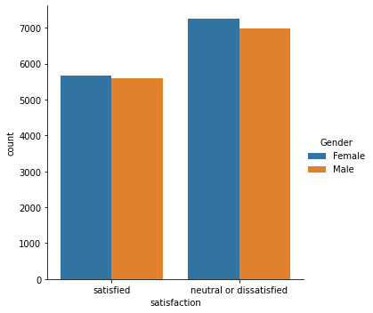
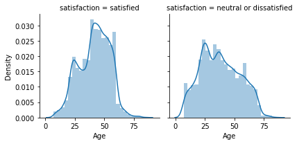
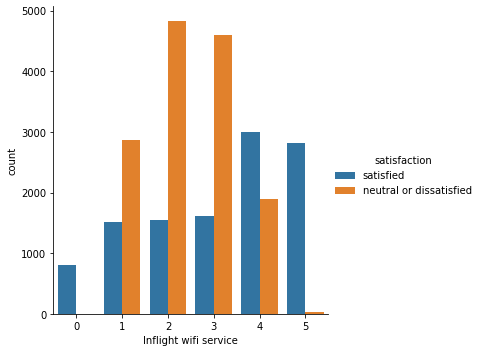
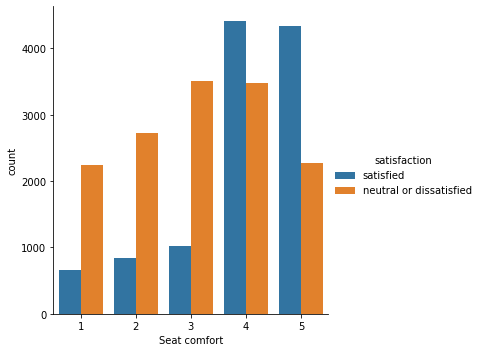
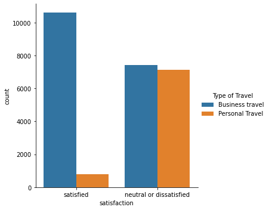
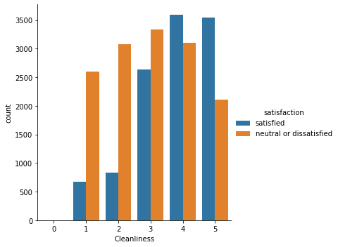
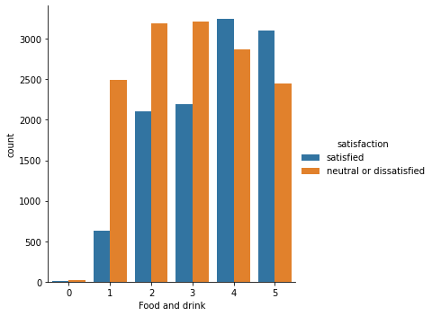

# Airline_Passenger_Satisfaction
This dataset contains an airline passenger satisfaction survey. What factors are highly correlated to a satisfied (or dissatisfied) passenger
Gender: Gender of the passengers (Female, Male)
Customer Type: The customer type (Loyal customer, disloyal customer)

There is the following information about the passengers of some airline:

- `Gender`: male or female
- `Customer type`: regular or non-regular airline customer
- `Age`: the actual age of the passenger
- `Type of travel`: the purpose of the passenger's flight (personal or business travel)
- `Class`: business, economy, economy plus
- `Flight distance`:The flight distance of this journey(km)
- `Inflight wifi service`: satisfaction level with Wi-Fi service on board (0: not rated; 1-5)
`Departure/Arrival time convenient`: departure/arrival time satisfaction level (0: not rated; 1-5)
`Ease of Online booking`: online booking satisfaction rate (0: not rated; 1-5)
`Gate location`: level of satisfaction with the gate location (0: not rated; 1-5)
`Food and drink`: food and drink satisfaction level (0: not rated; 1-5)
`Online boarding`: satisfaction level with online boarding (0: not rated; 1-5)
`Seat comfort`: seat satisfaction level (0: not rated; 1-5)
`Inflight entertainment`: satisfaction with inflight entertainment (0: not rated; 1-5)
`On-board service`: level of satisfaction with on-board service (0: not rated; 1-5)
`Leg room service`: level of satisfaction with leg room service (0: not rated; 1-5)
`Baggage handling`: level of satisfaction with baggage handling (0: not rated; 1-5)
`Checkin service`: level of satisfaction with checkin service (0: not rated; 1-5)
`Inflight service`: level of satisfaction with inflight service (0: not rated; 1-5)
`Cleanliness`: level of satisfaction with cleanliness (0: not rated; 1-5)
`Departure delay` in minutes
`Arrival delay` in minutes

This data set contains a survey on air passenger satisfaction. The following classification problem is set:

It is necessary to predict which of the two levels of satisfaction with the airline the passenger belongs to:

    Satisfaction
    Neutral or dissatisfied

Conclusions after EDA:

No of males and females who are satisfied with the airline is about the same

People who rated the
Inflight wifi service rated more than 3 were satisfied with airlines service

People who rated the seat comfort more than 3 are satisfied with the airlines service.

People who generally travelled business class were satisfies with the flight

People who rated the cleanliness more than 3 are satisfied with the airlines service.

People who rated the food and drink service more than 3 are satisfied with the airlines service.

<b>After fitting several classification models it can be seen that the RandomForestClassifier performs the best:</b>
| Model       | Accuracy    | F1 Score      |
| :---        |    :----:   |          ---: |
| DecisonTreeClassifier      | 78%        | 0.81  |
| RandomForestClassifier     | 79%        | 0.81  |
|LogisticRegression | 78% |0.83|  
|KNeighborsClassifier| 78% |0.84|  
|XGB| 78% |0.80 |
 
